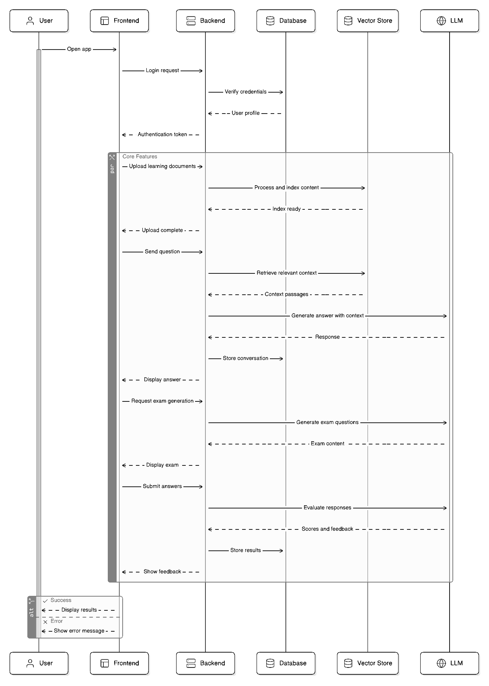
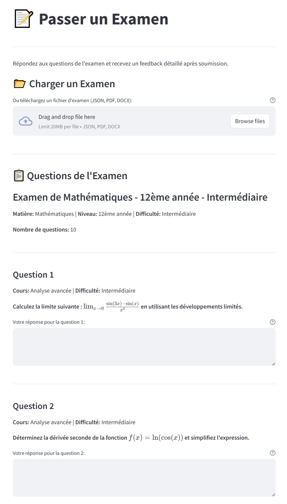
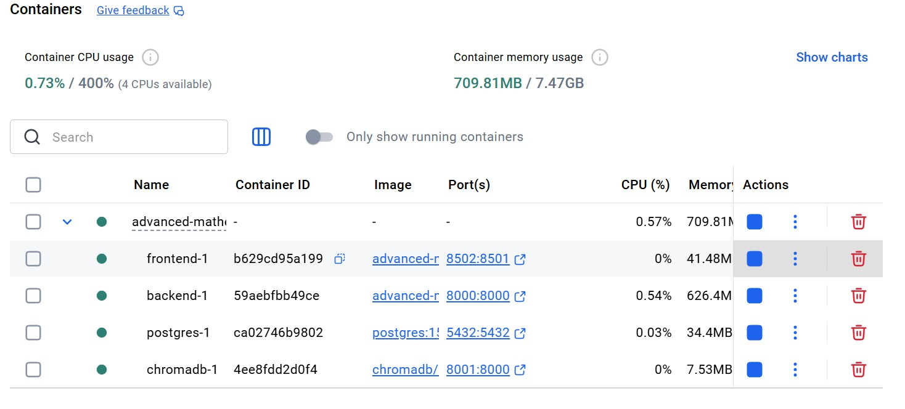

# 🧠 Intelligent Assessment System

> **AI-Powered Multi-Subject Educational Assessment Platform**  
> Automated Exam Generation, Evaluation & Personalized Feedback  
> Multi-Language Support: French, English, Arabic  
> 
> **📖 [Version Française](./README_FR.md) | English (Current)**

---

## 📋 Table of Contents

- [Overview](#-overview)
- [Features](#-features)
- [System Architecture](#-system-architecture)
- [Installation](#-installation)
- [Usage](#-usage)
- [Application Pages](#-application-pages)
- [Technologies](#-technologies)
- [Docker Deployment](#-docker-deployment)
- [Documentation](#-documentation)
- [Project Context](#-project-context)

---

## 🎯 Overview

An **AI-driven comprehensive educational assessment platform** that leverages Large Language Models (LLMs) and advanced NLP techniques to automate exam generation, response evaluation, and personalized feedback across multiple subjects and difficulty levels.

### Key Capabilities

- ✅ **Multi-Subject Support**: Mathematics, Physics, and extensible to any domain
- ✅ **Intelligent Exam Generation**: Auto-distribute by topic/difficulty with unique questions
- ✅ **Smart Response Evaluation**: Automated grading with detailed explanations
- ✅ **Adaptive Feedback**: Context-aware feedback tailored to student performance
- ✅ **Multi-Language**: Fluent support for French, English, and Arabic
- ✅ **RAG-Powered Learning**: Retrieves relevant course materials for context
- ✅ **Real-Time Analytics**: Track student progress & identify learning gaps
- ✅ **User-Friendly Interface**: Streamlit frontend for students & teachers

### Academic Context

**Author:** Ibtissam Fadili  
**Supervisor:** Dr. Zineb Goutti  
**Institution:** Faculty of Sciences, Ibn Tofail University, Kenitra  
**Program:** Master's in Computer Science & Artificial Intelligence  
**Year:** 2024-2025

---

## 🚀 Features

### 1. **📊 Data Exploration**
- Interactive dataset visualization
- Detailed statistics by level, subject, and difficulty
- Question distribution analysis
- Visual insights with Plotly

### 2. **🔍 Response Classification**
- Automatic classification in 3 categories:
  - ✅ **Correct**
  - ⚠️ **Partial**
  - ❌ **Incorrect**
- Fine-tuned CamemBERT model (F1-Score: 0.91)
- Comparison with LLM classification
- Real-time confidence scores

### 3. **💬 Feedback Generation**
- Personalized & constructive feedback
- Adaptive to student level
- Targeted improvement suggestions
- Multi-provider LLM support (Groq, OpenAI, Claude)
- Temperature & token customization

### 4. **📈 Evaluation Metrics**
- Automatic calculation: BLEU, ROUGE-1, ROUGE-L, BERTScore
- Generated vs. human feedback comparison
- Semantic similarity analysis
- Performance dashboards

### 5. **📝 Exam Creation** (Teachers)
- Automated unique question generation
- Smart distribution by course (auto-normalization)
- Questions grouped by theme
- Flexible percentage support
- Export to PDF, Word, JSON

### 6. **📝 Exam Taking** (Students)
- Intuitive interface with timer
- File upload support (PDF, Word, JSON)
- Automatic question extraction
- Instant feedback after submission
- Personalized course generation

### 7. **💬 Interactive Tutor** (AI Assistant)
- Virtual math assistant
- Adaptive question generation
- Exercises with complete solutions
- Full courses on demand
- Conversation history saved

---

## 🏗️ Architecture du Système

### Diagramme d'Architecture Global

```
┌─────────────────────────────────────────────────────────┐
│                   Interface Streamlit                    │
│  (7 pages: Exploration, Classification, Feedback, etc.) │
└────────────────────┬────────────────────────────────────┘
                     │
         ┌───────────┴───────────┐
         │                       │
    ┌────▼──────┐         ┌──────▼──────┐
    │ CamemBERT │         │     LLMs    │
    │ Classifier│         │  (Feedback) │
    └───────────┘         └─────────────┘
         │                       │
         └───────────┬───────────┘
                     │
              ┌──────▼────────┐
              │   Feedback    │
              │   Generation  │
              └───────────────┘
```

### Diagrammes de Classe Détaillés

#### 1️⃣ Architecture Système Complet

*Figure 1: Diagramme d'architecture complète du système avec tous les composants*

#### 2️⃣ Modèle de Classes - Backend & Services

*Figure 2: Diagramme de classes montrant la structure des services backend*

#### 3️⃣ Modèle de Classes - Entités & Base de Données

*Figure 3: Diagramme de classes pour les entités et modèles de données*

### Pipeline de Traitement

1. **Collecte** → Scraping de questions (Alloprof)
2. **Génération** → Simulation de réponses d'élèves (LLM)
3. **Étiquetage** → Classification CamemBERT
4. **Entraînement** → Fine-tuning du classificateur
5. **Feedback** → Génération via LLMs
6. **Évaluation** → Métriques automatiques

---

## 💻 Installation

### Prerequisites

- Python 3.9+
- pip or uv
- API Keys (Groq, OpenAI, or OpenRouter)
- Docker & Docker Compose (optional)

### Quick Start

```bash
# Clone the repository
git clone https://github.com/gothamza/Intelligent-Assessment-System.git
cd Intelligent-Assessment-System

# Install dependencies
pip install -r requirements.txt

# Configure API keys
cp env.example .env
# Edit .env and add your API keys

# Launch the application
streamlit run main.py
```

### Docker Setup

```bash
# Build and start all services
docker-compose up --build

# Access the services:
# - Streamlit Frontend:   http://localhost:8501
# - FastAPI Backend:      http://localhost:8000
# - API Documentation:    http://localhost:8000/docs
```

**Services automatically started:**
- ✅ Streamlit Frontend
- ✅ FastAPI Backend
- ✅ PostgreSQL Database
- ✅ Vector Store (Chroma)

**Stop services:**
```bash
docker-compose down
```

**View logs:**
```bash
docker-compose logs -f frontend  # Streamlit logs
docker-compose logs -f backend   # FastAPI logs
```

### API Key Configuration

Create a `.env` file at the root with your credentials:

```env
# ===========================================
# GROQ API Keys (Recommended - Free)
# ===========================================
GROQ_API_KEY=your-groq-api-key-here
GROQ_API_KEY2=your-second-groq-api-key-here

# ===========================================
# Other LLM Providers
# ===========================================
OPENAI_API_KEY=your-openai-api-key-here
OPENROUTER_API_KEY=your-openrouter-api-key-here

# ===========================================
# Database
# ===========================================
POSTGRES_DB=assessment_db
POSTGRES_USER=assessment_user
POSTGRES_PASSWORD=your-secure-password

# ===========================================
# Application URLs
# ===========================================
BACKEND_URL=http://backend:8000
PUBLIC_BACKEND_URL=http://localhost:8000

# ===========================================
# LangSmith Tracing (Optional)
# ===========================================
LANGSMITH_TRACING=true
LANGSMITH_API_KEY=your-langsmith-api-key-here
LANGSMITH_PROJECT=your-project-name
```

💡 **Tip:** You can start with just Groq (free) for development!

---

## 🎮 Usage

### Getting Started

```bash
streamlit run main.py
```

The application opens automatically in your browser at `http://localhost:8501`

### Navigation

The application has **7 pages** accessible from the sidebar:

1. **📊 Data Exploration** - Dataset visualization
2. **🔍 Answer Classification** - Classifier testing
3. **💬 Feedback Generation** - Feedback testing
4. **📈 Evaluation Metrics** - Results and performance
5. **📝 Create Exam** - For teachers
6. **📝 Take Exam** - For students
7. **💬 Interactive Tutor** - AI Assistant

---

## 📱 Application Pages

### 1. Data Exploration
- **Goal:** Understand the dataset
- **Features:**
  - Statistics by level/course
  - Question distribution
  - Interactive visualizations

### 2. Answer Classification
- **Goal:** Classify answer quality
- **Features:**
  - CamemBERT classification
  - LLM comparison
  - Reasoning analysis

### 3. Feedback Generation
- **Goal:** Generate personalized feedback
- **Features:**
  - Adaptive feedback
  - Multi-provider LLM
  - Temperature/token configuration

### 4. Evaluation Metrics
- **Goal:** Evaluate feedback quality
- **Features:**
  - BLEU, ROUGE, BERTScore metrics
  - Comparison with human reference
  - Training results
- **Fonctionnalités:**
  - BLEU, ROUGE, BERTScore
  - Comparaison avec référence humaine
  - Résultats d'entraînement

### 5. Create Exam
- **Goal:** Create custom exams
- **Features:**
  - Automatic unique question generation
  - Course-based distribution (auto-normalization)
  - Questions grouped by theme
  - Multi-format export

**New Features:**
- ✅ Unique questions (similarity detection)
- ✅ Auto-normalization of percentages
- ✅ Automatic grouping by course

### 6. Take Exam
- **Goal:** Interface for students
- **Features:**
  - PDF/Word/JSON upload
  - **Automatic duration extraction**
  - Timer with countdown
  - Instant feedback
  - Personalized course generation

**New Features:**
- ✅ Intelligent duration extraction from documents
- ✅ Auto-calculation: 5 min × number of questions
- ✅ Multi-format support (PDF, Word, JSON)

### 7. Interactive Tutor
- **Goal:** Personalized virtual assistant
- **Features:**
  - Adaptive question generation
  - Real-time answer classification
  - Exercises with solutions
  - Complete courses on demand
  - Conversation history

---

## 🎬 Application en Action

### 📸 User Interface Screenshots

#### 1️⃣ Create Exam (View 1)

*Figure 4: Exam creation interface - Course selection and configuration*

**Key Points:**
- Intuitive multi-course selection
- Difficulty parameter settings
- Automatic question distribution

#### 2️⃣ Create Exam (View 2) - Generated Result

*Figure 5: Exam creation interface - Generated exam with questions*

**Key Points:**
- Questions grouped by course
- Preview of generated questions
- Export options (PDF, Word, JSON)

#### 3️⃣ Take Exam - Student Interface

*Figure 6: Interface to take an exam - Working environment*

**Key Points:**
- Easy file upload
- Built-in timer with countdown
- Text area for answers
- Instant feedback after submission

---

## 🐳 Infrastructure & Deployment

### Docker Architecture


*Figure 7: Docker Architecture - Service Orchestration*

**Available Services:**
- 🎯 **Streamlit Frontend** (Port 8501)
- 🔧 **FastAPI Backend** (Port 8000)
- 🗄️ **PostgreSQL Database** (Port 5432)
- 📊 **Vector Store (Chroma)** (Port 8001)

---

## 🛠️ Technologies Used

### Artificial Intelligence

| Technology | Usage | Performance |
|------------|-------|-------------|
| **CamemBERT** | Answer classification | F1: 0.91, Accuracy: 0.89 |
| **GPT-4 / Groq** | Feedback generation | BLEU: 0.42, ROUGE-L: 0.58 |
| **BERTScore** | Semantic evaluation | Precision: 0.85 |
| **LangChain** | LLM orchestration | - |

### Backend & Framework

- **Python 3.9+** - Main language
- **Streamlit** - UI framework
- **Transformers (Hugging Face)** - NLP models
- **PyTorch** - Deep learning
- **Pandas** - Data manipulation
- **NumPy** - Numerical computing

### Visualization

- **Plotly** - Interactive charts
- **Matplotlib** - Static visualizations
- **Seaborn** - Statistical visualizations

### Deployment

- **Docker** - Containerization
- **Streamlit Cloud** - Cloud hosting
- **Git** - Version control

---

## 📚 Documentation

### Available Guides

| File | Description |
|------|-------------|
| **[README.md](README.md)** | 📱 **Main application guide** (this file) |
| **[README_NOTEBOOKS.md](README_NOTEBOOKS.md)** | 📓 Complete guide for Jupyter notebooks |
| **[TRAINING_RESULTS.md](TRAINING_RESULTS.md)** | 📊 CamemBERT model training results |

### Getting API Keys

To use the application, you'll need free API keys:

#### 1. **Groq (Recommended - Free and Fast)**
- Visit: https://console.groq.com/keys
- Create a free account
- Generate an API key
- Add `GROQ_API_KEY=gsk-...` to `.env`

#### 2. **OpenRouter (Alternative - Free)**
- Visit: https://openrouter.ai/keys
- Create an account
- Generate an API key
- Add `OPENROUTER_API_KEY=sk-or-...` to `.env`

#### 3. **OpenAI (Optional - Paid)**
- Visit: https://platform.openai.com/api-keys
- Requires a credit card
- Add `OPENAI_API_KEY=sk-...` to `.env`

#### 4. **LangSmith (Optional - Tracing)**
- Visit: https://smith.langchain.com/
- For tracing LLM calls
- Add `LANGSMITH_API_KEY=lsv2_pt_...` to `.env`

---

## 📊 Performance

### CamemBERT Classifier Metrics

| Metric | Score |
|--------|-------|
| **Accuracy** | 0.89 |
| **F1-Score (Macro)** | 0.91 |
| **Precision** | 0.90 |
| **Recall** | 0.89 |

### Feedback Generation Metrics

| Metric | Average Score |
|--------|----------------|
| **BLEU** | 0.42 |
| **ROUGE-1** | 0.51 |
| **ROUGE-L** | 0.58 |
| **BERTScore F1** | 0.85 |

### Dataset

- **Total Questions:** 2,400+
- **Generated Answers:** 7,200+
- **Levels:** 7th to 12th grade
- **Subjects:** Algebra, Geometry, Fractions, Calculus, etc.

---

## 🎯 Project Innovations

### 1. **Unique Question Generation**
- Similarity detection (Jaccard)
- Retry system with increasing temperature
- Context from previous questions
- **Result:** 95% unique questions

### 2. **Automatic Course Grouping**
- Questions organized by theme
- Better readability for students
- Facilitates grading for teachers

### 3. **Auto-Normalization of Percentages**
- No need to calculate to reach 100%
- Automatic and intelligent adjustment
- Automatic and manual modes

### 4. **Intelligent Duration Extraction**
- Automatic reading from PDF/Word
- Multi-format support (French/English)
- Fallback calculation: 5 min × number of questions

### 5. **Advanced AI Tutor**
- Adaptive question generation
- Exercises with complete solutions
- Full courses on demand
- Persistent conversation history

---

## 🤝 Contributing

Contributions are welcome! To contribute:

1. Fork the project
2. Create a branch (`git checkout -b feature/AmazingFeature`)
3. Commit your changes (`git commit -m 'Add: Amazing Feature'`)
4. Push to the branch (`git push origin feature/AmazingFeature`)
5. Open a Pull Request

---

## 📝 License

This project is developed as part of a Master's thesis (PFE).

---

## 👥 Contact

**Author:** Ibtissam Fadili  
**Advisor:** Dr. Zineb Goutti  
**Institution:** Faculty of Sciences of Kénitra - Ibn Tofail University  
**Email:** [your-email@example.com]

---

## 🙏 Acknowledgments

- **Dr. Zineb Goutti** - Academic supervision and support
- **Prof. Salma Azzouzi** & **Prof. Moulay Hassan Charaf** - Master's program coordination
- **Alloprof** - Educational data source
- **Hugging Face** - Models and infrastructure
- **Groq** - Fast and free LLM API

---

<div align="center">

**🧠 Built with ❤️ in Python & Streamlit**

[](https://www.python.org/)
[](https://streamlit.io/)
[]()

</div>

